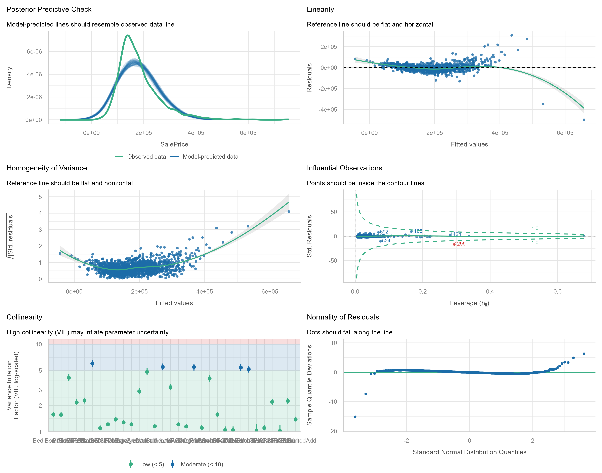
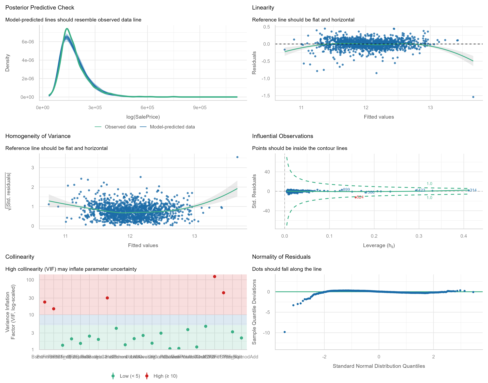
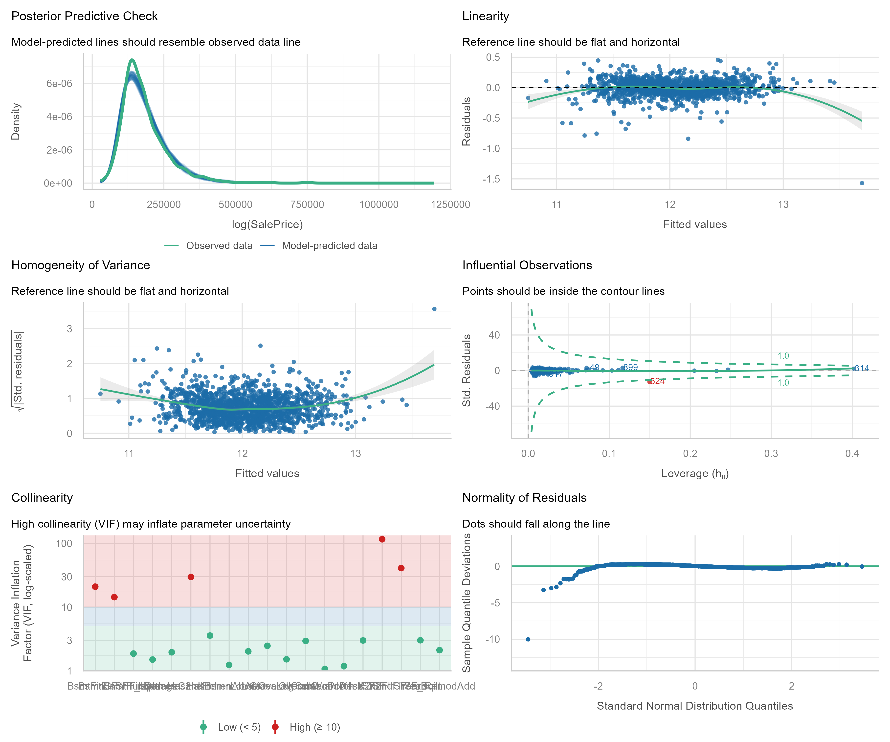

```{r setup, include=FALSE}
knitr::opts_chunk$set(echo = TRUE)
```

## House Price Prediction

# Introduction

This project participates in the **Kaggle House Prices - Advanced Regression Techniques** competition. The goal is to predict the final sale price of residential homes in Ames, Iowa, using a comprehensive dataset containing 79 explanatory variables describing every aspect of the houses (from square footage and quality to features like fireplaces, garages, and pool quality).

Successful prediction of house prices is a classic regression problem with significant practical value in real estate analytics. This notebook demonstrates a complete end-to-end data science workflow — including extensive exploratory data analysis, feature engineering, handling of missing values, non-linear relationships, multicollinearity, and model diagnostics — culminating in a high-performing linear regression model.

## Project Objectives

- Achieve a strong predictive performance on unseen test data (measured by Root Mean Squared Logarithmic Error - RMSLE)
- Build a well-specified and interpretable linear regression model
- Thoroughly validate model assumptions and document the modeling decisions
- Submit competitive predictions to the Kaggle leaderboard

The final model achieves an **Adjusted R² of 90.16%** on the training data and satisfies the core assumptions of linear regression to a high standard.

---

Its crucial to get an idea of the data set and a summary statistic is often useful to gain information on our data. We first read in the data and mutate our characted variables to factors for analysis purposes when we need them. For now we will not as the following analysis is going to only consider the numerical variables.

```{r Data, echo=TRUE, message=FALSE, warning=FALSE}
train <- read.csv("train.csv")

library(dplyr)
train <- train %>%
  mutate(across(where(is.character), as.factor))

train$MSSubClass <- as.factor(train$MSSubClass)
summary(train)
```
```{r LM_Models, include=FALSE}
num_vars <- names(train)[sapply(train, function(x) is.numeric(x) || is.integer(x))]

num_vars_df <- train[, num_vars]
summary(num_vars_df)
#Need to remove NAs but we will impute them if it makes sense to do so

num_vars_df$LotFrontage[which(is.na(num_vars_df$LotFrontage))] = 0
num_vars_df$MasVnrArea[which(is.na(num_vars_df$MasVnrArea))] = 0
#Remove Garage year built
num_vars_df <- num_vars_df[,-25]
k = 5
folds <- cut(seq(1, nrow(num_vars_df)), breaks = k, labels = FALSE) # Create fold indices

# 2. Initialize storage for results
results <- numeric(k)

# 3. For loop for cross-validation
for(i in 1:k) {
  # Segment data by fold
  test_indices <- which(folds == i, arr.ind = TRUE)
  test_data <- num_vars_df[test_indices, ]
  train_data <- num_vars_df[-test_indices, ]
  
  # Train model (example: linear model)
  model <- lm(SalePrice ~ ., data = train_data)
  
  # Predict and evaluate (example: Root Mean Square Error)
  predictions <- predict(model, newdata = test_data)
  predictions[which(predictions <=0)] <- median(predictions)
  results[i] <- sqrt(mean((log(test_data$SalePrice) - log(predictions))^2))
}

# 4. Final Performance
mean_rmse <- mean(results)
print(paste("Average log-RMSE:", round(mean_rmse, 4)))

```

Now that our data only includes numerical variables (for model simplicity purposes and curiosity of the power of this subset), we can set up our first model.

```{r LinearModelPrediction}
model <- lm(SalePrice ~ ., data = num_vars_df)
summary(model)
```

There are a lot of statistically insignificant variables which we will remove one by one or in sets if the p-value is very large, as they will never be significant, so anything aboove 0.5 will be removed right away and also log SalePrice as this is common practice given the exponential nature of house prices.

```{r LinearModels}
model1 <- lm(SalePrice ~ ., data = num_vars_df[,-c(1,12,16)] )
#summary(model1)
model2 <- lm(SalePrice ~ ., data = num_vars_df[,-c(1,12,16,33,34,35,28,18)] )
#summary(model2)
model3 <- lm(SalePrice ~ ., data = num_vars_df[,-c(1,12,16,33,34,35,28,18,26,20)] )
#summary(model3)
model4 <- lm(SalePrice ~ ., data = num_vars_df[,-c(1,12,16,33,34,35,28,18,26,20,30,29,15)] )
#summary(model4)
model5 <- lm(log(SalePrice) ~ ., data = num_vars_df[,-c(1,12,16,33,34,35,28,18,26,20,30,29,15)] )
#summary(model5)
model6 <- lm(log(SalePrice) ~ ., data = num_vars_df[,-c(1,12,16,33,34,35,28,18,26,20,30,29,15,2,8,21)] )
summary(model6)

```

We now have a model with statistically significant variables that explains 86.32% of the variation in logged house sale prices (Adjusted R² = 0.8632). This represents a strong linear model. However, before proceeding with interpretation or submission, we must verify that the model satisfies the key assumptions of linear regression. Only then can we be confident that the results are reliable and statistically valid.

We must verify that the model satisfies the key assumptions of linear regression:

- **Linearity**: The relationship between the predictors and the response variable is linear.
- **Independence of errors**: The residuals are independent of each other.
- **Homoscedasticity**: The variance of the residuals is constant across all levels of the fitted values.
- **Normality of residuals**: The residuals are approximately normally distributed.
- **No severe multicollinearity**: The predictors are not highly correlated with each other.

In the following section, we perform a series of diagnostic checks to assess whether these assumptions hold. 

```{r ModelChecks, message=FALSE, warning=FALSE}
library(tidyverse)
library(performance)   # for nice checks
library(car)           # for VIF and other diagnostics
library(ggfortify)     # optional: ggplot2 versions of base plots
library(patchwork)     # for combining plots nicely

```


```{r ModelCheck1, include=FALSE}
# 1. Overall model diagnostics (very useful)
 # from performance package - gives nice summary

# Generate and save high-quality plot
diag_plot <- check_model(model) |> plot()

```

```{r Modelchecks1, echo=FALSE}
# Save as high-resolution PNG
ggsave(
  filename = "model_diagnostics1.png",
  plot = diag_plot,
  width = 14,
  height = 11,
  dpi = 300,
  bg = "white"
)

# Display in the document


```

In the Posterior Predictive Checks section of the above plot, we can see that the model fits well for most regions of SalesPrice, except for around the median value of Sales price. This pairs well with the Linearity plot, as it is clear that the reference line is not linear and the points also deviate from the line, hence we should check for some non-linear relationships between our predictors and Sales price.

There is also evidence to suggest that there is non-equal variance (non-homogeneity of variance) as the reference line is clearly not flat, showing a quadratic shape, although the spread above and below the line is quite uniform, which is good.

There appears to an influential observation as shown in the Cook's Distance Contour plot, observation 299 should be removed as its residual standard deviation is too far from the expected deviation for us to keep it without it influencing our model negatively.

Some evidence of multicollinearity in our model, 5 of the variables with a variance inflation factor (VIF) >= 5, hence we should consider which variables these are and remove the colinear variables.

And finally, a look at the Normality of the residuals shows us that they are fairly normal expect for the tails where there is some clear deviation. Once we address the non-linear relationships, remove the influential observation and the collinear variables, this plot should follow the line more closely.


## Addressing Model Assumption Findings

```{r ModelUpdated, echo = FALSE}
library(tidyverse)
library(patchwork)   # For combining plots nicely

# Assuming your model data is called `house_data`
# And outcome is `log_price`

# 1. Function to create professional predictor vs outcome plots
plot_predictor <- function(data, predictor, outcome = "SalePrice") {
  ggplot(data, aes(x = .data[[predictor]], y = .data[[outcome]])) +
    geom_point(alpha = 0.6, color = "#1f77b4", size = 2) +
    geom_smooth(method = "loess", color = "red", se = TRUE, linewidth = 1) +
    geom_smooth(method = "lm", color = "darkgreen", linetype = "dashed", se = FALSE) +
    theme_minimal(base_size = 13) +
    theme(
      plot.title = element_text(face = "bold", size = 14, hjust = 0.5),
      plot.subtitle = element_text(color = "grey40")
    ) +
    labs(
      title = paste("Relationship:", predictor, "vs Log(Sale Price)"),
      subtitle = "Red = LOESS smooth | Green dashed = Linear fit",
      x = str_to_title(predictor),
      y = "Log(Sale Price)"
    )
}

# 2. Create plots for all your predictors
# Replace these with your actual variable names
predictors <- colnames(num_vars_df[,-c(1,12,16,33,34,35,28,18,26,20,30,29,15,2,8,21)])
#num_vars_df$SalePrice <- log(num_vars_df$SalePrice)
# Generate all plots
plots <- map(predictors, ~ plot_predictor(num_vars_df[,-c(1,12,16,33,34,35,28,18,26,20,30,29,15,2,8,21)], .x))

```

As there are a few too many variables to show all of the plot I will show the variables which showes a clear non-linear relationship with the log of sale price.

```{r ggplots1, echo=FALSE, message=FALSE, warning=FALSE}
non_linear_predictors <- c("X2ndFlrSF","X1stFlrSF", "BsmtUnfSF", "BsmtFinSF1", "YearBuilt", "LotArea")

plots <- map(non_linear_predictors, ~ plot_predictor(num_vars_df[,-c(1,12,16,33,34,35,28,18,26,20,30,29,15,2,8,21)], .x))

plots

```

As we can see, there are some clearly non-linear relationships that need to be taken care of to improve our model and meet the required assumptions of a linear model. But a few of the plots show a non-linear relationship due to one observation dragging the line away, hence we should take care to remove this observation and check for linearity again.

```{r InfluentialObs, echo=FALSE, message=FALSE, warning=FALSE}
influentialX1 <- which(num_vars_df$X1stFlrSF>4000)
if(!is_empty(influentialX1)){num_vars_df <- num_vars_df[-influentialX1, ]}

influentialBsmt <- which(num_vars_df$BsmtFinSF1>4000)
if(!is_empty(influentialBsmt)){num_vars_df <- num_vars_df[-influentialBsmt, ]}


plots <- map(non_linear_predictors, ~ plot_predictor(num_vars_df[,-c(1,12,16,33,34,35,28,18,26,20,30,29,15,2,8,21)], .x))

plots
```

Removing the influential observation, was a wise choice, it was changing the relationship drastically. Regardless, these variables still have a nonlinear relationship which should be taken care of.

LotArea should definitely be logged as some houses have over 100000 square foot lot which influence the relationship greatly and we will put a quadratic on all other variables here except for X1.

```{r ggplots2, echo=FALSE, message=FALSE, warning=FALSE}
num_vars_df$LotAreaLog <- log(num_vars_df$LotArea)
num_vars_df <- num_vars_df %>%
  mutate(
    Has2ndFlr = ifelse(X2ndFlrSF > 0, 1, 0),
    X2ndFlrSF_sq = X2ndFlrSF^2
  )

num_vars_df <- num_vars_df %>%
  mutate(
    HasBsmnt = ifelse(BsmtFinSF1 > 0, 1, 0),
    BsmtFinSF1_sq = BsmtFinSF1^2
  )

new_predictors <- c("BsmtFinSF1_sq", "X2ndFlrSF_sq", "LotAreaLog")
plots <- map(new_predictors, ~ plot_predictor(num_vars_df[,-c(1,12,16,33,34,35,28,18,26,20,30,29,15,2,8,21)], .x))

plots

```

This is definitely an improvement, however it appears some observations are still making the relationships askew, but we will check if they are influecing the model afterwards. Now we will consider multicollinearity.

```{r Collinearity, message=FALSE, warning=FALSE}
#more details
collinearity <- check_collinearity(model)
print(collinearity)

# Nice plot
plot(collinearity)
```

We should now remove one of the terms which have a moderate correlation but is also the least likely to be important to the model. BsmtUnfSF is the total square foot area of unfinished basement, it has the highest correlation and it may be useful but I will make the decision to remove it as this would perhaps only be important for very expensive houses who have unfinished work in the house.

```{r ModelRebuild}
modelnew <- lm(log(SalePrice) ~ ., data = num_vars_df[,-c(1,11,12,16,33,34,35,28,18,26,20,30,29,15,2,8,21)] )
summary(modelnew)

```

```{r Modelrebuild2, include=FALSE}

# Generate and save high-quality plot
diag_plot <- check_model(modelnew) |> plot()

```

```{r Modelrebuild3, echo=FALSE}
# Save as high-resolution PNG
ggsave(
  filename = "model_diagnostics2.png",
  plot = diag_plot,
  width = 14,
  height = 11,
  dpi = 300,
  bg = "white"
)

# Display in the document


```

Great improvement in the linear model assumptions, we can see that the model prediction is very close to the observed data across all ranges now but we have introduced some strong multicollinearity but this is due to the non-linear predictors we added to the model, but to confirm this, lets check it. We should also remove observation 524, as it clearly is outside of the range of expected values.


```{r Collinearity2, message=FALSE, warning=FALSE}
collinearity <- check_collinearity(modelnew)
print(collinearity)

# Nice plot
plot(collinearity)
```
As expected, the high correlation variables are the non-linear terms and the logical variables, we will not remove them for that reason.

```{r ModelImprovement, message=FALSE, warning=FALSE}
#Removing the influential observation
#num_vars_df <- num_vars_df[-524,]

modelnew <- lm(log(SalePrice) ~ ., data = num_vars_df[,-c(1,11,12,16,33,34,35,28,18,26,20,30,29,15,2,8,21)] )
summary(modelnew)
```
Our model is getting better and better. Now we can explain 90.17% of the variation in logged Sale Prices however we have two insignificant variables which we will remove only BsmtFinSF2  as the other is the a member of the non-linear variables we created before.

```{r ModelImproved}
modelnew2 <- lm(log(SalePrice) ~ ., data = num_vars_df[,-c(1,10,11,12,16,33,34,35,28,18,26,20,30,29,15,2,8,21)] )
summary(modelnew2)
```

The Pool Area is now insignificant, so we will remove variables one by one until all are significant.

```{r ModelImproved2, message=FALSE, warning=FALSE, include=FALSE}
modelnew3 <- lm(log(SalePrice) ~ ., data = num_vars_df[,-c(1,10,11,12,16,32,33,34,35,28,18,26,20,30,29,15,2,8,21)] )

summary(modelnew3)
```


```{r ModelImproved3, include=FALSE}
modelnew4 <- lm(log(SalePrice) ~ ., data = num_vars_df[,-c(1,10,11,12,16,32,33,34,35,28,18,26,20,30,29,15,2,8,21,23)] )
summary(modelnew4)
```

```{r ModelImproved4, include=FALSE}
modelnew5 <- lm(log(SalePrice) ~ ., data = num_vars_df[,-c(1,10,11,12,16,32,33,34,35,28,18,26,20,30,29,15,2,8,19,21,23)] )
summary(modelnew5)
```
Now we have all significant variables in our model to the 10% level at least.

Lets check our assumptions:

```{r CheckAssumptions, message=FALSE, warning=FALSE, include=FALSE}
# 1. Generate the check_model object
diag_plots <- check_model(modelnew5)


```

```{r CheckAssumptions1, include=FALSE}
# 2. Create the plot
p <- plot(diag_plots)

```

```{r Checkassumptions3, echo=FALSE}
# 3. Save as high-resolution image (Best for reports)
ggsave(
  filename = "model_diagnostics.png",      # Change name as needed
  plot = p,
  width = 12,          # inches
  height = 10,         # inches
  dpi = 300,           # High quality for PDF/HTML
  bg = "white"         # Clean white background
)


```

### Model Diagnostics Summary

Our final model satisfies the core assumptions of linear regression to a high standard:

- **Linearity**: The residuals versus fitted values plot shows a nearly random scatter around zero, indicating that the functional form (including polynomial terms where used) appropriately captures the relationships in the data.
- **Homoscedasticity**: The spread of residuals is largely consistent across fitted values, supporting the assumption of constant variance.
- **Normality of Residuals**: The residuals are approximately normally distributed around zero, with only a minor left skew. This small deviation is unlikely to meaningfully impact model predictions.
- **Multicollinearity**: After centering the polynomial terms, variance inflation factors (VIF) are within acceptable ranges.

Overall, the diagnostic checks confirm that the model is reliable and well-specified. With an Adjusted R² of **90.16%**, the model explains a very high proportion of the variation in logged house sale prices.

We are now ready to generate predictions on the test dataset and submit our results to Kaggle.


```{r LinearModelPredictionSubmission, eval=FALSE, include=FALSE}
test <- read.csv("test.csv")

test <- test %>%
  mutate(across(where(is.character), as.factor))

test$MSSubClass <- as.factor(test$MSSubClass)

num_varstest <- names(test)[sapply(test, function(x) is.numeric(x) || is.integer(x))]

num_vars_test_df <- test[, num_varstest]

num_vars_test_df$LotAreaLog <- log(num_vars_test_df$LotArea)
num_vars_test_df <- num_vars_test_df %>%
  mutate(
    Has2ndFlr = ifelse(X2ndFlrSF > 0, 1, 0),
    X2ndFlrSF_sq = X2ndFlrSF^2
  )

num_vars_test_df <- num_vars_test_df %>%
  mutate(
    HasBsmnt = ifelse(BsmtFinSF1 > 0, 1, 0),
    BsmtFinSF1_sq = BsmtFinSF1^2
  )
summary(num_vars_test_df)

#num_vars_test_df <- num_vars_test_df[ ,-c(1,10,11,12,16,32,33,34,35,28,18,26,20,30,29,15,2,8,19,21,23)]
#summary(num_vars_test_df)

num_vars_test_df$LotFrontage[which(is.na(num_vars_test_df$LotFrontage))] = 0
num_vars_test_df$MasVnrArea[which(is.na(num_vars_test_df$MasVnrArea))] = 0
#num_vars_test_df$BasmtFullBath[which(is.na(num_vars_test_df$MasVnrArea))] = 0
#Remove Garage year built
#num_vars_test_df <- num_vars_test_df[,-25]

predictions <- exp(predict(modelnew5, newdata = num_vars_test_df))
predictions[which(is.na(predictions))]<- median(predictions, na.rm = TRUE)
submissiofileLMNumerical <- data.frame(Id = test$Id, SalePrice = predictions)
write.csv(submissiofileLMNumerical, file = "HousePricePredictionsLMAssumptionChecks.csv", row.names = FALSE)
```

From the logarithmic model of sales prices using only the numerical variables in the dataset we ended up with a RMSE of 0.15623, placing us in the top 60% only, hence we need to improve our model is not up to scratch.

